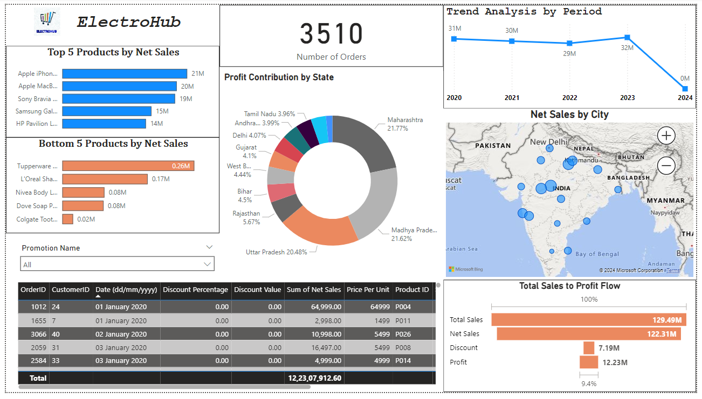

# **ElectroHub Sales Analysis Dashboard**

## **Overview**
This project involves creating a comprehensive Power BI dashboard for ElectroHub, a retail company offering products in multiple categories: **Electronics**, **Footwear**, **Clothing**, **Home Appliances**, **Accessories**, **Kitchenware**, **Bags**, and **Personal Care**. The dashboard provides actionable insights based on sales data to aid business decisions.

---

### **Dashboard Overview**
The dashboard provides an interactive summary of sales, profit, and discounts across multiple dimensions.

---

## **Data Source**
The data for this project is sourced from:
1. **SQL Server**: Primary data source.
2. **Excel File**: Provided as a reference for validation and additional context.

### **Data Schema**
The dataset follows a **star schema** design, consisting of:
- **Fact Table**: Contains sales transactions and performance metrics.
- **Dimension Tables**: Provide descriptive attributes for products, customers, and promotions.

---

### **Tables**
#### 1. **Dim Product**
| Column Name       | Description                           |
|-------------------|---------------------------------------|
| ProductID         | Unique identifier for products.       |
| Product Name      | Name of the product.                  |
| Product Line      | Category of the product.              |
| Price (INR)       | Unit price of the product.            |

#### 2. **Dim Customer**
| Column Name       | Description                           |
|-------------------|---------------------------------------|
| Customer ID       | Unique identifier for customers.      |
| Customer Name     | Full name of the customer.            |
| City              | Customer's city.                     |
| State             | Customer's state.                    |
| Pincode           | Customer's postal code.              |
| EmailID           | Customer's email address.            |
| Phone Number      | Customer's contact number.           |

#### 3. **Dim Promotion**
| Column Name        | Description                          |
|--------------------|--------------------------------------|
| PromotionID        | Unique identifier for promotions.    |
| Promotion Name     | Name of the promotion campaign.      |
| Ad Type            | Type of advertisement used.          |
| Coupon Code        | Discount code associated.            |
| Price Reduction Type | Type of price reduction offered.    |

#### 4. **Fact Table**
| Column Name          | Description                        |
|----------------------|------------------------------------|
| Date                 | Transaction date.                  |
| CustomerID           | Linked to Dim Customer.            |
| PromotionID          | Linked to Dim Promotion.           |
| Product ID           | Linked to Dim Product.             |
| Units Sold           | Quantity of product sold.          |
| Price Per Unit       | Price of each product unit.        |
| Total Sales          | Total amount before discounts.     |
| Discount Percentage  | Percentage discount applied.       |
| Discount Value       | Monetary value of the discount.    |
| Net Sales            | Total after discounts.             |
| Profit               | Revenue minus costs.               |

---

## **Insights and Visualizations**
### **Key Questions Answered**
1. **Top/Bottom 5 Products**: By sales, profit, and quantity sold.
2. **Sales Trends**: Analysis over time (daily, monthly, quarterly, yearly).
3. **Sales-Profit Relationship**: Identify patterns and anomalies.
4. **Period Comparison**: Compare sales, profit, and quantity sold between two periods.
5. **Discount Analysis**: Average discount offered across categories.
6. **Order Count**: Total number of orders processed.
7. **Detailed Order Information**: Filterable by product, date, customer ID, or promotion categories.
8. **Sales by City**: Geographic sales distribution.

### **Dashboard Highlights**
- **Donut Chart**: Product category contribution to total sales.
- **Funnel Chart**: Sales flow from discounts to profit.
- **Bar and Line Charts**: Time-based sales trends.
- **Scatter Plot**: Sales vs. profit relationship.
- **Slicers and Filters**: Interactive filters for product categories, date ranges, and customer demographics.

---

## **Usage**
1. **Open the Dashboard**: The Power BI file (`Analysis_SalesBI.pbix`) contains all visualizations and reports.
2. **Interactive Exploration**:
   - Use slicers and filters to focus on specific product lines, cities, or promotions.
   - Drill through to detailed reports for in-depth analysis.

---

## **Key Outcomes**
- Enhanced understanding of sales and profit patterns.
- Insights into discount effectiveness and promotional ROI.
- Identification of high-performing and underperforming product categories and regions.

